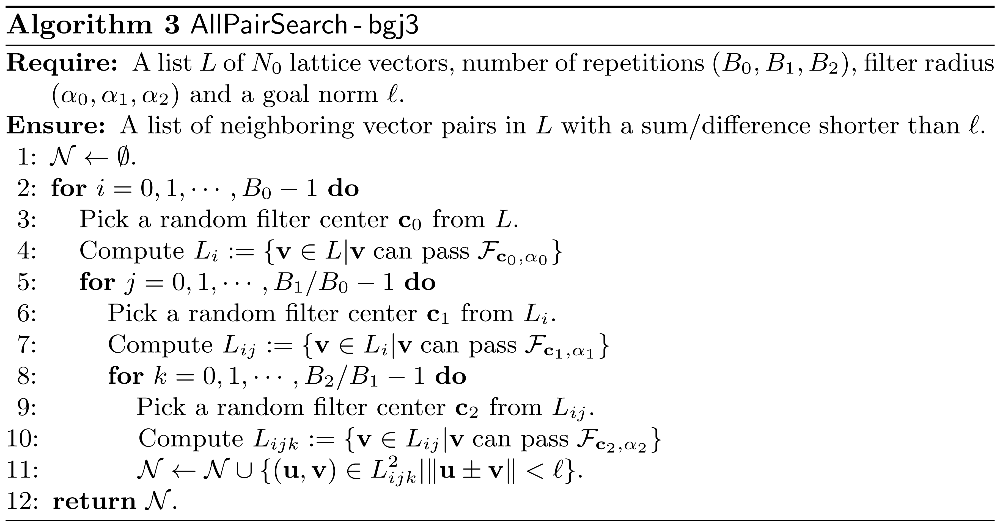
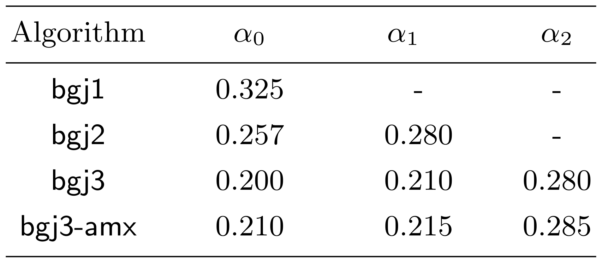
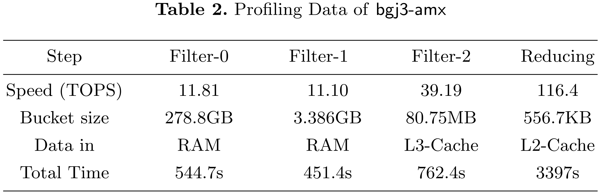
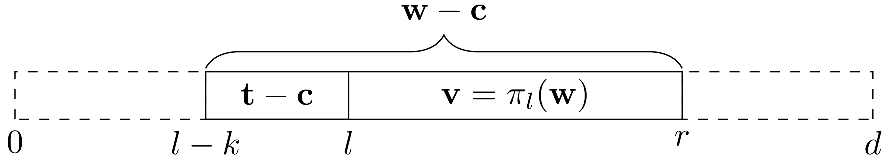
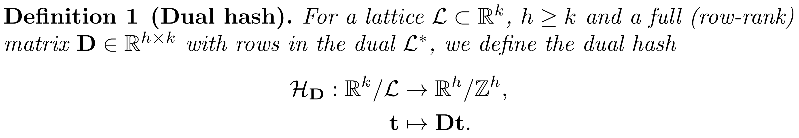
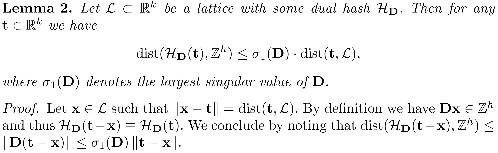

<!-- _class: cover_a -->
<!-- _paginate: "" -->
<!-- _footer: "" -->

# BGJ15 Revisited: Sieving with Streamed  Memory Access

Ziyu Zhao, Jintai Ding, Bo-Yin Yang

## 简介

研究问题：内存友好的筛法（连续读取，压缩存储）

核心想法：

- BGJ的bucketing完成后，每个bucket中向量内存地址是离散的，不利于读取

论文贡献：

- 将sub-bucket储存在更小，更快的存储设备中。sub-bucket之间无需交流，内部流式读取
- 向量坐标使用8位有符号数存储，必要时使用对偶LLL约化基恢复系数
- 改进on-the-fly-lifting，提供更多免费维度

## BGJ3

---

参数：

- 新向量到达$0.025N_0$后进行插入与重新排序
- $B_{i}/B_{i-1}$(每个bucket的子bucket数量)：64-512，与架构相关
- $\alpha_i$：需要精心挑选的重要参数（g6k-cpu：$\alpha_0=0.366$，渐进最优但不是实际最优）

## 内存访问问题

- BDGL：一次分为$2^{O(n)}$个bucket，main db下的随机访问
- BGJ：$O(log(n))$次，每个bucket的sub bucket数量为$2^{O(n/log(n))}$，只涉及sub bucket的随机访问

140维profile：

## 优化（低精度向量）

- 过滤和约化：8位精度
- 插入：32位精度

缩放因子：$254.0\cdot (sup_{0\le i \le n-1}||b_i^*||)^{-1}$

- 计算B的对偶基，进行LLL约化，得到较短的对偶向量
- 使用较短的对偶向量计算相对于基B的整数系数
- 使用整数系数恢复向量

## 提升

- $v\in L_{[l:r]}$提升到$w\in L_{[l-k:r]}$，实际上是$L_{[l-k:l]}$上的$\delta-BDD$问题，一般$\delta\in[0.1,0.5]$

---

- 将k维格中的距离转化为h维整数格中的距离

---

如何构造D

- 初始化：使用h个最短对偶向量
- 贪心：替换一些行，降低$Tr(D^tD)/det(D^tD)^{1/k}$

## 优化（免费维度）

- 基于LSF的DH：DH后的检查依然为二次，使用一个中心初筛
- 向量分数，不比长度，比分数
  - 可以让提升后较短的向量插入到main db 中

$$
score(v)=\inf_{0\le l'\le l} \frac{||Lift_{l'}(v)||}{gh(L_{[l',n]})}
$$

## 实现

- 格基
  - 每个坐标使用quad_float
- 主数据库（每个向量）
  - 每个坐标使用8位带符号整型
  - 二范数平方使用32位带符号整数
  - 所有坐标之和使用32位带符号整数
  - uid使用64位

## 总结

格中最短向量问题（SVP）是格密码学中的核心难题。格密码中许多底层问题（NTRU，SIS，LWE）的密码学分析都可以归结为格中最短向量问题。SVP求解算法分为两类：枚举与筛选。枚举算法使用搜索与剪枝对全空间进行遍历；筛选算法对大量向量进行两两组合，保留新生成的短向量，逐步降低向量集合的整体长度。该论文对筛法进行改进，作者注意到现有算法存在一些内存问题，包括大规模的内存随机读取过多和高维度问题求解时内存占用过大。作者使用三重bgj算法提高数据读取的局部性，并压缩向量坐标的存储空间，使用8位进行存储，降低了内存需求。作者使用这两种方法提升了筛法的求解效率和理论可求解维度。我认为该论文确实改善了当前筛法的内存瓶颈，具有实际意义。（315）
