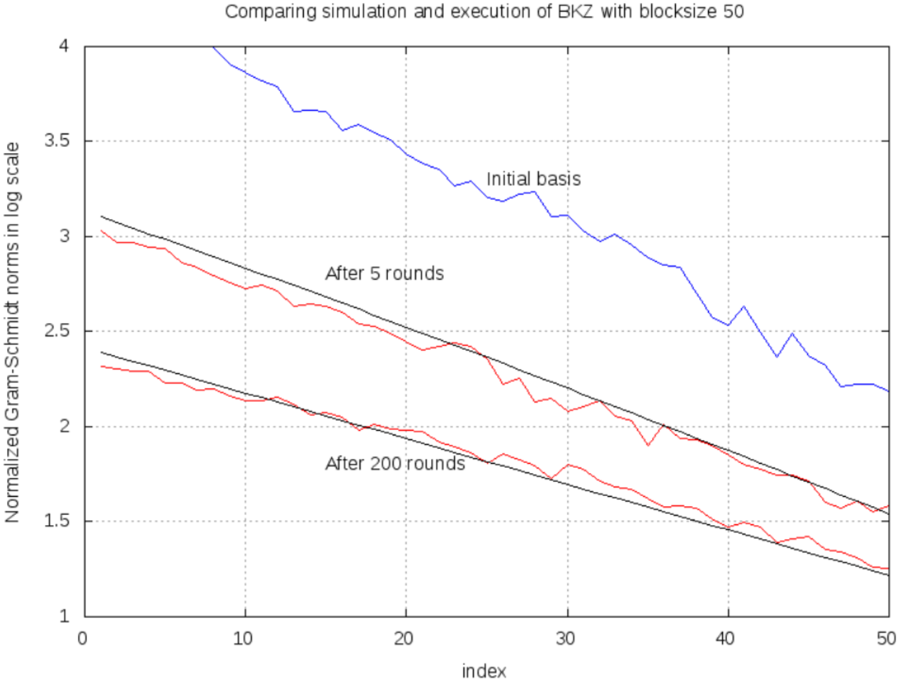
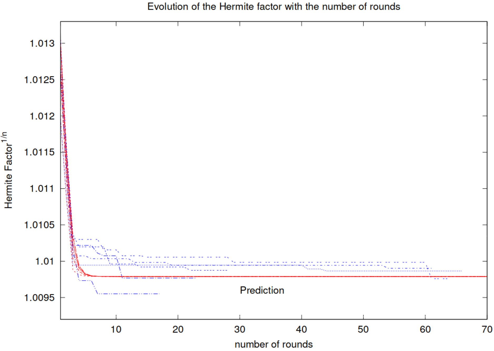

<!-- _class: cover_a -->
<!-- _paginate: "" -->
<!-- _footer: "" -->

# BKZ 2.0: Better Lattice Security Estimates

Yuanmi Chen, Phong Q. Nguyen
ASIACRYPT(CCF-B) 2011

## 研究问题及研究意义

研究问题：优化基于BKZ算法的格基约化

研究意义：格基约化可以求解近似SVP，并帮助枚举和筛法求解精确SVP

## 核心想法

针对BKZ算法最耗时的部分：枚举子算法

- 深度剪枝：结合高概率剪枝和极限剪枝

- 局部块预处理

- 优化枚举半径：结合高斯估计的半径

<!-- 算法优化的第一部是找出一个算法中最为耗时的部分并进行针对性的优化。在BKZ 2.0中，作者发现BKZ算法最耗时的部分是当块较大时的枚举子算法，所以作者从以下三个角度对枚举子算法进行了优化。首先是剪枝，对递归的每一层进行更为细致的剪枝，保证总体程序的高成功概率；其次是预处理，原算法中使用LLL算法进行预处理，但枚举后可能产生约化程度更高的约化基，作者使用BKZ预处理代替LLL预处理；最后是对枚举半径的优化，原算法的枚举半径使用现有的正交基，作者结合高斯估计，减小了初始枚举半径，从而降低枚举时间。 -->

## 论文贡献

- 改进BKZ算法，提升了性能，首次将分块大于40的BKZ算法用于高维格

- 提出了一种模拟算法，能模拟分块大于50的BKZ算法的预期结果和运行时间

- 改进了格上困难问题的安全性估计

<!-- 将枚举子算法进行改进后，BKZ2.0算法能够支持更大分块，更高维格的BKZ格基约化，并且作者提出的模拟算法可以在算力受限的情况下得到算法的预期结果和运行时间，在理论和实践方面都有贡献，除此之外，模拟算法还可以改进格上困难问题的安全性估计。 -->

## 实验结果

<!-- _class: cols-2 -->

<!-- 该实验结果为模拟算法与实际算法的对比，可以看出该模拟算法可以较好的模拟BKZ算法。 -->

## 个人评价

- 针对算法中最为耗时的部分并进行优化

- 在计算时间复杂度困难时可以考虑使用模拟算法

改进意见：

- 增加块移动步长，提高效率

## 总结

格基约化算法是格密码学中的核心算法，也是进行格分析的核心步骤。格基约化可以求解近似SVP，并帮助枚举和筛法求解精确SVP。BKZ算法是实践中最佳的格基约化算法，其思想为分块进行投影格上的精确枚举算法，求解SVP，并将结果作为正交基，经典的LLL算法可以看作块大小为2的BKZ算法。在研究中，作者发现对BKZ算法运行时间影响最大的是枚举子算法。作者使用深度剪枝、局部块预处理和优化枚举半径三种方法进行改进，并提出BKZ2.0算法，可以在高维格中进行块大小较大的BKZ格基约化。除此之外，作者提出了一种模拟BKZ算法预期结果与运行时间的算法，不仅可以帮助分析时间复杂度，而且可以改进格上困难问题的安全性估计。我认为作者对于算法优化的思路值得借鉴，而且模拟算法的提出有助于后续的算法设计。（308）
