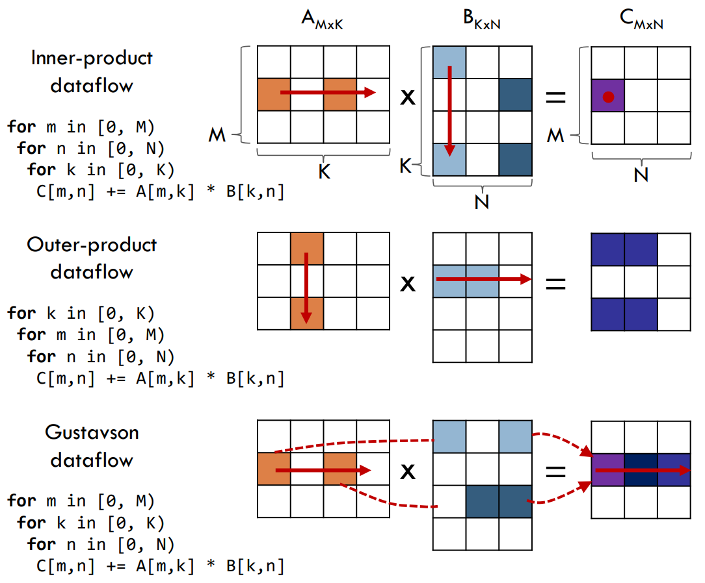

<!-- _class: cover_a -->
<!-- _paginate: "" -->
<!-- _footer: "" -->

# Gamma: Leveraging Gustavson’s Algorithm to Accelerate Sparse Matrix Multiplication

ASPLOS 2021

## 研究意义与动机

稀疏矩阵乘法是许多稀疏算法的核心，如稀疏深度神经网络，稀疏线性和张量代数，图分析等。提高速度或是降低缓存空间都可以提高稀疏矩阵乘法在cpu与gpu上的运行效率。

问题特性：

- 运算较少
- 访存随机

Gustavson算法：行平稳的数据流，改善访存，但存在不规则的数据重用。

### 压缩存储结构

- 压缩稀疏行（CSR）

  非零元素保存列标号，使用额外的一个offset数组标记每一行的起始位置。

- 压缩稀疏列（CSC）

### 数据流

<!-- _class: cols-2-46 hugetext-->

- 内积：良好的输出重用性；输入可能无效
- 外积：良好的输入重用性；输出难以组合
- Gustavson：行平稳

### 动态调度策略

矩阵A并行的行尽可能多的重用矩阵B中的行。

算法：维护一个优先队列，保存待处理的所有A行 所需要的 但未被缓存的行数。

改进：对于非零元素较多的A的行进行拆分，以适应行复用及缓存空间的大小。

## 贡献

- 使用了之前被错过的Gustavson算法，改进了稀疏矩阵乘法的数据流
- 对于不规则的数据重用构建了新的缓存结构和动态调度策略

## 评价

- 提升性能的重点为优化访存（计算与缓存）
- 使用优先队列（或其他的算法）进行访存优化
- 原文还有硬件设计相关的细节

## 总结

稀疏矩阵乘法是计算机领域中的基础问题，是许多稀疏算法的核心，如稀疏深度神经网络，稀疏线性和张量代数，图分析等。通过提高运行速度或是降低所需的缓存空间，都可以提高稀疏矩阵乘法在cpu与gpu上的运行效率。该论文从优化访存的角度出发，利用Gustavson算法，使得稀疏矩阵乘法的数据流行平稳化，从而使得内存的访问局部连续化。作者还针对该访存模式设计了片上存储结构和对应的动态调度算法，相较于同类的硬件系统提高了性能并降低了片上储存空间。
