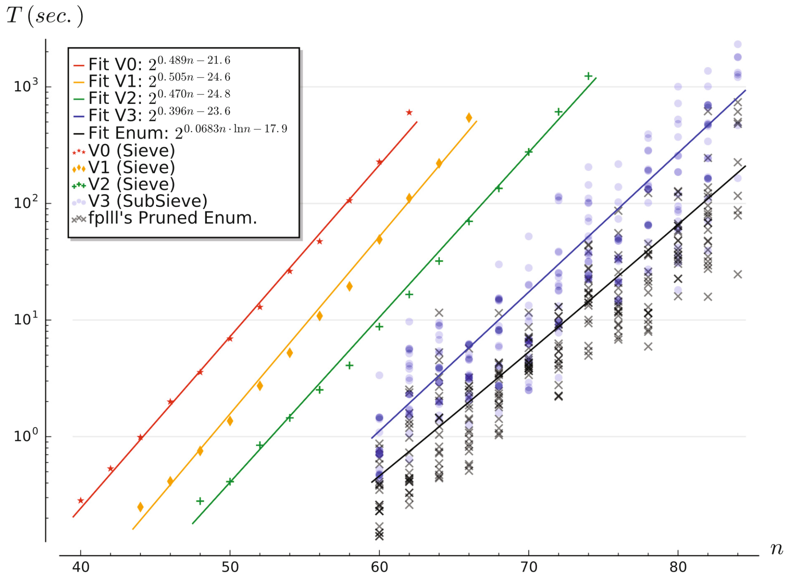

<!-- _class: cover_a -->
<!-- _paginate: "" -->
<!-- _footer: "" -->

# Shortest Vector from Lattice Sieving: A Few Dimensions for Free

L&eacute;o Ducas
EUROCRYPT(CCF-A) 2018

## 研究问题及研究意义

研究问题：使用筛法求解格中最短向量问题（SVP）

研究意义：格中最短向量问题是格密码学中的核心难题，许多底层问题（NTRU，SIS，LWE）的密码学分析都可以归结为该问题。

## 核心想法

- 筛法会输出比格中最短向量更多的信息（一系列短向量）

- 在n-d维子格上进行筛法（显著提升效率）

- 提升n-d维子格的结果到n维完整格（Babai算法）

## 实验结果

<!-- _class: cols-2-37 -->

- 可以明显的看出使用子格进行求解后效率提升很大

## 论文贡献

- 给出合理的d取值：$d \approx \frac{n \ln{(4/3)}}{\ln{(n/2\pi e)}}$

- 实现了子格筛法与提升算法，相较于当时的筛法效率提升10倍

## 个人评价

- 核心想法为充分利用现有结果中的信息，值得学习

- 筛法的时间与空间复杂度均为指数级，在低维子格中进行筛法求解不仅可以缩短求解时间，而且可以降低存储空间的需求

由于对SVP求解了解不多，仅从算法角度考虑改进：

- 选择不同的投影方式，并行求解多个子格，并综合结果

- 如果投影后维数依然较高，进行迭代投影

## 总结

格中最短向量问题（SVP）是格密码学中的核心难题。格密码中许多底层问题（NTRU，SIS，LWE）的密码学分析都可以归结为格中最短向量问题。SVP求解算法分为两类：枚举与筛选。枚举算法使用搜索与剪枝对全空间进行遍历；筛选算法对大量向量进行两两组合，保留新生成的短向量，逐步降低向量集合的整体长度。该论文对筛法进行改进，作者注意到筛法的结果中包含大量的短向量，如果只关注格中的最短向量，会导致其他的短向量结果被浪费。于是作者提出，在求解n维格的SVP时，只要对n-d维格进行筛法SVP求解，再使用代数方法将结果提升到n维。作者实现的新筛法相较于其他筛法速度提升10倍。我认为作者充分利用了现有结果中的信息，筛法的时间与空间复杂度均为指数级，在低维子格中进行筛法求解不仅可以缩短求解时间，而且可以降低存储空间的需求。（322）
