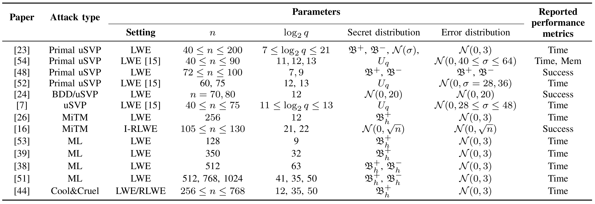
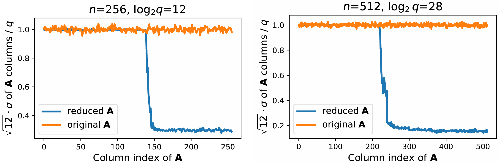
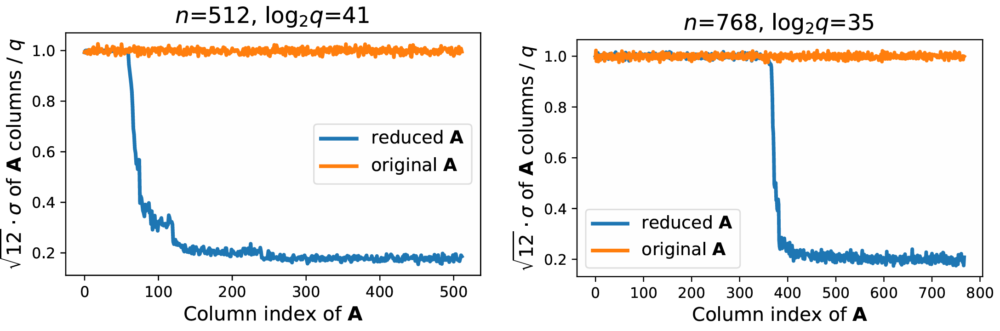
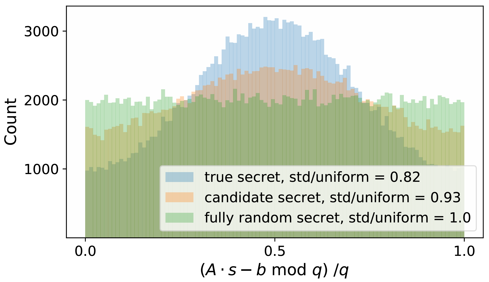

<!-- _class: cover_a -->
<!-- _paginate: "" -->
<!-- _footer: "" -->

# Benchmarking Attacks on Learning with Errors

Emily Wenger, Eshika Saxena, Mohamed Malhou, Ellie Thieu, Kristin Lauter

## LWE及其变种

- LWE：$\boldsymbol{b} = \boldsymbol{A} \cdot \boldsymbol{s} + \boldsymbol{e}$，($\boldsymbol{A} \in \mathbb{Z}_q^{m \times n}$，$\boldsymbol{s} \in \mathbb{Z}_q^n$，$\boldsymbol{b},\boldsymbol{e} \in \mathbb{Z}_q^m$)
  - Search LWE：给出$(\boldsymbol{A},\boldsymbol{b})$，恢复$\boldsymbol{s}$
  - Decision LWE：给出$(\boldsymbol{A},\boldsymbol{b})$，区分$(\boldsymbol{A},\boldsymbol{x})$，其中$\boldsymbol{x}$为均匀随机分布

- Ring-LWE：$b(X)=a(X) \cdot s(X) + e(X)$，$(b(X),a(X),s(X),e(X) \in R_{q,n} = \mathbb{Z}_q[X]/(X^n+1))$

- Module-LWE：$\boldsymbol{b(X)}=\boldsymbol{A(X)} \cdot \boldsymbol{s(X)} + \boldsymbol{e(X)}$，($\boldsymbol{A(X)} \in R_q^{k \times l}$，$\boldsymbol{s(X)} \in R_q^l$，$\boldsymbol{b(X)},\boldsymbol{e(X)} \in R_q^k$)

## LWE攻击方法概述

- Lattice Reduction：格基约化，LLL，BKZ，etc.
- uSVP：恢复嵌入格中的最短向量
- Machine Learning - SALSA：对约化后的LWE数据进行机器学习模型训练
- Cool and Cruel：对约化后的LWE数据进行暴力搜索
- Dual Hybrid - MitM：寻找对偶格中的最短向量，进行区分，攻击Decision-LWE
- ...

## 攻击效果汇总

- $\mathfrak{B}^+ \sim \{0,1\}$，$\mathfrak{B}^- \sim \{-1,0,1\}$，$U_q \sim \mathbb{Z}_q$，参数$h$：固定$h$个非零坐标
- 中心二项分布：$\mathfrak{B}^\eta \sim \sum_{i=1}^\eta(a_i-b_i), (a_i,b_i \in \{0,1\})$
- 离散高斯分布：$\mathcal{N}(\mu,\sigma)$

## uSVP

- Kannan嵌入：给出$(\boldsymbol{A},\boldsymbol{b})\in (\mathbb{Z}_q^{m \times n},\mathbb{Z}_q^m)$，按行向量构建格：

$$
\begin{bmatrix}
  0 & q\boldsymbol{I_m} & 0 \\
  \boldsymbol{I_n} & \boldsymbol{A^T} & 0 \\
  0 & \boldsymbol{b} & 1
\end{bmatrix}
$$

- 格中包含短行向量：$\begin{bmatrix} \boldsymbol{s} & \boldsymbol{-e} & \boldsymbol{-1} \end{bmatrix}$

## Machine Learning - SALSA

- 初始：获取4n个LWE样本，$(\boldsymbol{A},\boldsymbol{b})\in (\mathbb{Z}_q^{4n \times n},\mathbb{Z}_q^{4n})$
- 采样：从初始样本中多次采样，$(\boldsymbol{A_i},\boldsymbol{b_i})\in (\mathbb{Z}_q^{m \times n},\mathbb{Z}_q^{m})$，q-ray嵌入构造格：

$$
\boldsymbol{\Lambda_i}

=

\begin{bmatrix}
  0 & q\boldsymbol{I_n} \\
  \omega\boldsymbol{I_m} & \boldsymbol{A_i}\\
\end{bmatrix}
$$

- 约化：对$\boldsymbol{\Lambda_i}$格基约化，得到线性变换$\begin{bmatrix} \boldsymbol{L} & \boldsymbol{R} \end{bmatrix} \in (\mathbb{Z}_q^{(m+n) \times n},\mathbb{Z}_q^{(m+n) \times m})$，最小化矩阵的范数：
  - 此处$\omega$体现约化强度和约化带来误差的trade-off

$$
\begin{bmatrix} \boldsymbol{L} & \boldsymbol{R} \end{bmatrix}\boldsymbol{\Lambda_i}

=

\begin{bmatrix} \boldsymbol{L} & \boldsymbol{R} \end{bmatrix}
\begin{bmatrix}
  0 & q\boldsymbol{I_n} \\
  \omega\boldsymbol{I_m} & \boldsymbol{A_i}\\
\end{bmatrix}

=

\begin{bmatrix} \omega\boldsymbol{R} & \boldsymbol{RA_i} + q\boldsymbol{L} \end{bmatrix}
$$

- ML样本：将矩阵$\boldsymbol{R}$作用于原始样本，得到$(\boldsymbol{RA_i},\boldsymbol{Rb_i})\in (\mathbb{Z}_q^{(m+n) \times n},\mathbb{Z}_q^{m+n})$，
  - 该样本保持原LWE的秘密向量$\boldsymbol{s}$，但具有更大的误差：

$$
\boldsymbol{Rb_i} = \boldsymbol{RA_i} \cdot \boldsymbol{s} + \boldsymbol{Re_i}
$$

---

- ML希望拟合一个函数$f: \mathbb{Z}_q^n \to \mathbb{Z}_q$，$b = f(\boldsymbol{a})$
  - 在足够多的数据训练下，假设$f$已经隐式学习到了$f(\boldsymbol{a})=\boldsymbol{a}\cdot \boldsymbol{s}$
- 提取秘密向量：
  - 此处$\boldsymbol{\varepsilon_i}$代表第i位为1，其他位置为0的向量

$$
\hat{s_i} = \frac{\partial f}{\partial a_i}(\boldsymbol{a}) = \frac{f(\boldsymbol{a}+\delta \boldsymbol{\varepsilon_i})-f(\boldsymbol{a})}{\delta}
$$

## Cool and Cruel

<!-- _class: cols-2-46 -->

- 预处理、约化部分与ML相同，得到$(\boldsymbol{A'},\boldsymbol{b'})=(\boldsymbol{RA_i},\boldsymbol{Rb_i})$
  - 发现$\boldsymbol{A'}$部分列不符合均匀分布$U_q$
  - 标准差：$\sigma = \frac{q}{\sqrt{12}}$
- "cruel"：$\sigma > \frac{q}{2\sqrt{12}}$，记作$\boldsymbol{A'_u}$
- "cool"：$\sigma < \frac{q}{2\sqrt{12}}$，记作$\boldsymbol{A'_r}$
  

---

<!-- _class: cols-2-46 -->

$$
\begin{align*}
\boldsymbol{Rb_i} &= \boldsymbol{RA_i} \cdot \boldsymbol{s} + \boldsymbol{Re_i} \\
\boldsymbol{b'} &= \boldsymbol{A'} \cdot \boldsymbol{s} + \boldsymbol{e'} \\
\boldsymbol{b'} &= \begin{bmatrix}\boldsymbol{A'_u} & \boldsymbol{A'_r} \end{bmatrix} \cdot \begin{bmatrix}\boldsymbol{s_u} & \boldsymbol{s_r} \end{bmatrix} + \boldsymbol{e'} \\
\boldsymbol{b'} &= \boldsymbol{A'_u} \cdot \boldsymbol{s_u} + \xcancel{\boldsymbol{A'_r} \cdot \boldsymbol{s_r} + \boldsymbol{e'}}
\end{align*}
$$

- 暴力搜索"cruel"变量，通过残差分布判断是否继续恢复
- 贪心/线性回归/其他优化方法确定"cool"变量，选择让标准差更大的赋值

