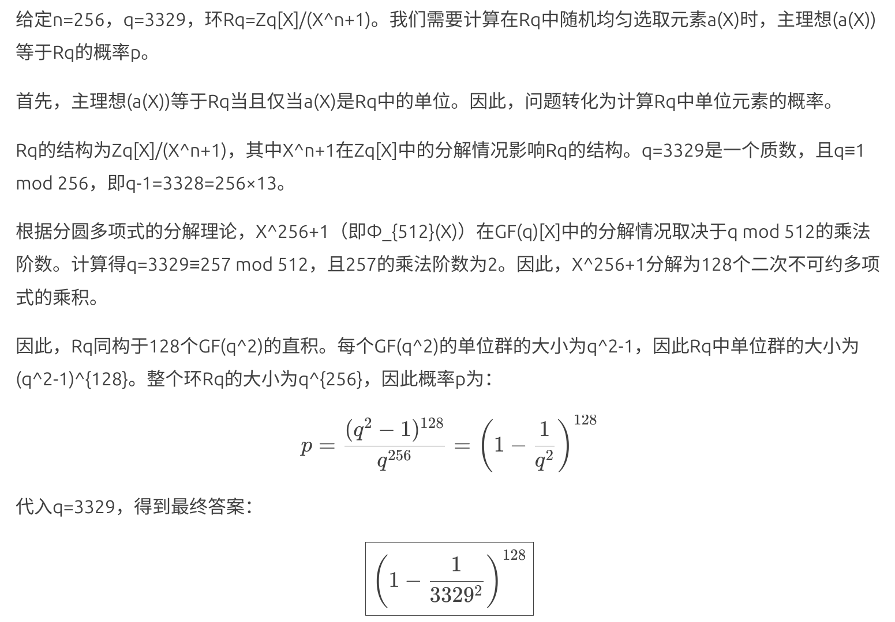

# LWE介绍

## LWE

## RLWE

多项式环：$R_{m,f}=\mathbb{Z}_m[X]/(f(X))$

例子：$R=\mathbb{Z}_{17}[X]/(X^4+1)$，已知随机多项式$a(X)$，目标多项式$t(X)$，求“小”的私密多项式$s(X)$，误差多项式$e(X)$

$$
\begin{align*}
a(X) &= 2+7X-6X^2+4X^3 \\
t(X) &= -2-5X+X^2-5X^3 \\
t(X) &= a(X)s(X)+e(X)  \\
t(X) &= a(X)(1-X+X^3)+(-1+X+X^2)

\end{align*}
$$

条件：对“小”的私密多项式$\bm{s}$的约束

- 二范数约束：$||s(X)||_2 < 10$，（5题）
- 项数约束：$\text{wt}(s(X)) \le 3$，（1题）
  - wt()代表非零项个数
- 二范数+无穷范数约束：$||s(X)||_2 < 11,||s(X)||_\infty\le 1$，（1题）

## MLWE

矩阵形式的RLWE，矩阵大小$(k,l)$，$k$个目标多项式，$l$个私密多项式，对应$k\times l$个随机多项式，$k$个误差多项式

$$

t(X)^T = A(X)s(X)^T+e(X)^T

$$

条件：

- 二范数约束：$(k,l)=(2,2)$，$||s_i(X)||_2<25(i=0,1)$，（1题）

## 赛题

- (20分)固定$n=256$, $q=3329$, 环$R_q=\mathbb{Z}_q[X]/(X^n+1)$. 在$R_q$中按均匀分布随机选取元素$a(X)$, 给出主理想$(a(X))$等于$R_q$的概率

$$
p = \text{Prob}\{(a(X))=R_q\}
$$

- (15+15+20+20+20+25+25+25分)求解私密多项式(组)$s(X)$和错误多项式(组)$e(X)$或尝试分析求解所需的计算复杂度
  - 缺少误差分布？

- (40分)创新

## 环LWE转化为LWE

多项式乘法转化为矩阵乘法

定义映射：$\Phi:R_{m,f} \to (Z_m)^n, \sum_{i=0}^{n-1}a_iX^i \mapsto (a_0,a_1,\cdots,a_{n-1})$

$$

a(X)s(x) \iff

\begin{bmatrix}
\Phi(a(X))^T & \Phi(a(X)X)^T & \cdots & \Phi(a(X)X^{n-1})^T
\end{bmatrix}

\times

\Phi(s(X))

$$

例子：$R=\mathbb{Z}_{17}[X]/(X^4+1)$

$$

(2+7X-6X^2+4X^3)(1-X+X^3) \iff

\begin{bmatrix}
2  & -4 & 6  & -7 \\
7  & 2  & -4 & 6  \\
-6 & 7  & 2  & -4 \\
4  & -6 & 7  & 2
\end{bmatrix}

\times

\begin{bmatrix}
1  \\
-1 \\
0  \\
1
\end{bmatrix}

$$
