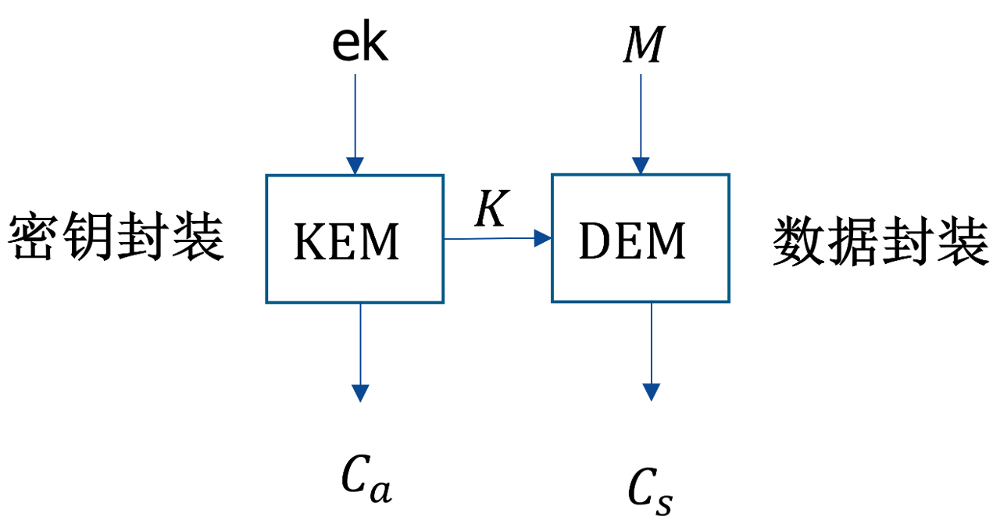

# 公钥密码

## NIST后量子密码算法征集概述

密码算法种类：

- 公钥加密与密钥封装机制（KEMs）：用于在不安全信道中安全建立共享密钥。
- 数字签名：用于身份认证和数据完整性验证。

数学难题种类：

- 基于格 (Lattice-based)：CRYSTALS-KYBER（用于加密/KEM）和CRYSTALS-DILITHIUM（用于签名）
- 基于编码 (Code-based)
- 基于多变量 (Multivariate-based)
- 基于哈希 (Hash-based)
- 其他

## 公钥加密和密钥封装的区别

将传统的公钥加密拆分为密钥封装+对称加密(KEM-DEM)两个部分

优点：

- 效率优化：专为密钥传输设计的KEM在效率和密文大小上通常比直接使用通用的公钥加密算法更优；后续对数据进行对称加密通常比直接使用公钥加密更快。
- 简化安全性证明：在可证明安全领域，为KEM设计安全证明比为一个能加密任意消息的全功能公钥加密方案更简单。

## 密钥分发与密钥交换

- 密钥分发：由通信中的一方生成一个对称会话密钥，然后通过某种安全方式将这个密钥“分发”或“传递”给另一方的过程。

- 密钥交换：指的是通信双方通过交换一些公开参数，各自独立地计算出一个相同的共享密钥。这个共享密钥不是由一方生成并传给另一方的，而是双方共同贡献随机性并通过数学计算衍生出来的。

现代密码学（尤其后量子密码）中，密钥分发和密钥交换逐渐融合成密钥封装(KEM)：分发简单（密钥分发形式）；内部数学原理复杂，安全性高（密钥交换内核）。

## CRYSTALS-KYBER

### 符号说明

多项式环：$R_q = \mathbb{Z}_q[X] / (X^n + 1)$

中心二项分布：$x \sim \mathrm{CBD}_\eta $

$$
x = b_1-b_2\in[-\eta,\eta], \quad b_1,b_2 \sim B(\eta,0.5)
$$

小多项式分布：$x \sim S_\eta \subset R_q$
$$
x = x_0X^0 + x_1X^1+ \ldots+ x_{n-1}X^{n-1}, \quad x_i \sim \mathrm{CBD}_\eta
$$

### 密钥生成

$$
t = A \times s + e, \\
A \sim_U R_q^{k\times k}, \quad s,e \sim S_{\eta_1}^{k\times 1}, \quad t \in R_q^{k\times1}.
$$

- 公钥：$(A,t) \in (R_q^{k\times k}, R_q^{k\times 1})$
- 私钥：$(s) \in (S_{\eta_1}^{k\times 1})$

### 加密

- 消息编码：将 $n$ 位二进制消息编码到环 $R_q$ 中的一个多项式 $m \in R_q$
  - 常用方法：将比特 $0$ 映射为 $0$，比特 $1$ 映射为 $\lfloor q/2 \rfloor$

$$
\begin{cases}
u = A^T \times r + e_1, \\
v = t^T \times r + e_2 + m,
\end{cases} \\
r,e_1 \sim S_{\eta_2}^{k\times 1}, \quad e_2 \sim S_{\eta_2}, \quad u \in R_q^{k\times 1}, \quad v \in R_q.
$$

### 解密

$$
m' = v - s^T \times u = m + r \cdot e - s \cdot e_1 + e_2,
$$

- 对多项式 $m'$ 进行解码
  - 接近 $0$ 解码为比特 $0$，接近 $\lfloor q/2 \rfloor$ 解码为比特 $1$

### 参数选择

| 参数集    | $q$  | $n$  | $k$  | $\eta_1$ | $\eta_2$ |
| --------- | ---- | ---- | ---- | -------- | -------- |
| Kyber512  | 3329 | 256  | 2    | 3        | 2        |
| Kyber768  | 3329 | 256  | 3    | 2        | 2        |
| Kyber1024 | 3329 | 256  | 4    | 2        | 2        |

## CRYSTALS-DILITHIUM

### 密钥生成

- 生成种子：$(\rho, \rho', K) \xleftarrow{\mathrm{SHAKE}} seed$

- 由 $\rho$ 生成矩阵：$A = \mathrm{ExpandA}(\rho) \in R_q^{k \times l}$

- 由 $\rho'$ 生成短秘密向量：$(s_1,s_2) = \mathrm{ExpandS}(\rho') \in (S_\eta^{l \times 1}, S_\eta^{k\times 1})$

$$
\tilde{t} = A \times s_1 + s_2 \in R_q^{k\times 1}
$$

- 系数分解：$t_1 \cdot 2^d + t_0 = \tilde{t}$

- 公钥哈希：$tr = H(\rho \| t_1)$

- 输出：
  - 公钥：$pk = (\rho, t_1)$
  - 私钥：$sk = (\rho, K, tr, s_1, s_2, t_0)$

### 签名

- 绑定消息：$ \mu = H(tr \| M)$

- 循环（拒绝采样）：
  - 采样：$y = \mathrm{ExpandMask}(K,\mu)\sim_U[-\gamma_1+1, \gamma_1-1]^l \in R_q^{l\times 1}$
  - 计算：$w = A\times y \in R_q^{k\times 1}$
  - 分解：$w_1\cdot(2\gamma_2) + w_0 = w, \quad w_0\in (-\gamma_2,\gamma_2]$
  - 生成挑战：$c = \mathrm{SampleInBall}(H(\mu \| w_1))$
    - 在扩展输出字节流中进行拒绝采样
    - 确保：$c \in R_q$，恰60个系数为 $\pm 1$，其余为 $0$
  - 确保以下条件成立，否则重新循环：
    - 计算响应：$z = y + c \cdot s_1$
      - 确保：$\|z\|_\infty < \gamma_1 - \beta$
    - 校验低位调整：$r = w - c \cdot s_2 + c \cdot t_0$
      - 确保：生成一个提示信息 $h$，使得 $r$ 在 $h$ 的帮助下可以获得正确的 $w_1$，且提示信息影响的位置数量小于 $\omega$。

- 输出签名：$\sigma = (z, h, c)$

### 验证

- 验证：$\|z\|_\infty < \gamma_1 - \beta$
- 计算：
  - 公钥哈希：$tr = H(\rho \| t_1)$
  - 绑定消息：$\mu = H(tr \| M)$
  - 重构矩阵：$A = \mathrm{ExpandA}(\rho)$
  - 重构 $\tilde{t}$
    - 计算：$w' = A\times z - c \cdot (t_1 \cdot 2^d) = w - c\cdot s2 + c\cdot t_0$
    - 利用提示信息 $h$ 恢复真实的高位 $w_1'$
- 验证：$c = \mathrm{SampleInBall}(H(\mu \| w_1'))$

### 参数选择

| 参数集        | $q$ | $n$ | $k$ | $l$ | $η$ | $d$ | $\gamma1$  | $\gamma2$        | $\beta$ | $\omega$ | 签名大小(≈) | 公钥(≈) | 私钥(≈) |
|--------------|---|---|----|--------------|-------------------|-----|----|-------------|---------|---------|---------|---------|---------|
| Dilithium2   | 8380417 | 256 | 4 | 4 | 2  | 13    | $2^{17}$      | $(q-1)/88$        | 78  | 80 | ~2420 B     | ~1184 B | ~2800 B |
| Dilithium3   | 8380417 | 256 | 6 | 5 | 4  | 13    | $2^{19}$      | $(q-1)/88$        | 196 | 55 | ~3293 B     | ~1472 B | ~3500 B |
| Dilithium5   | 8380417 | 256 | 8 | 7 | 4  | 13    | $2^{19}$      | $(q-1)/32$        | 120 | 75 | ~4595 B     | ~1760 B | ~3850 B |