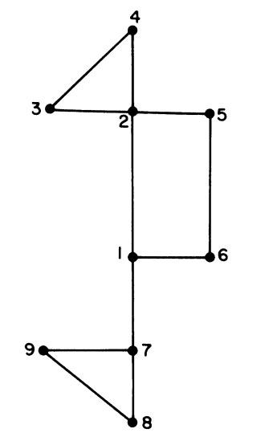
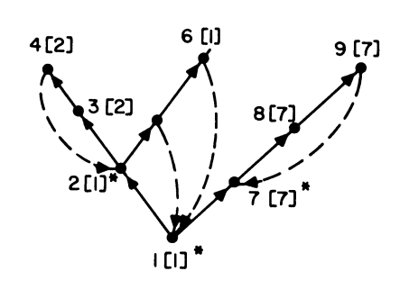
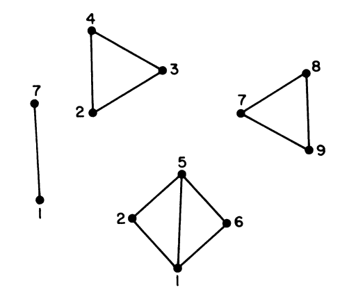

<!-- _class: cover_a -->
<!-- _paginate: "" -->
<!-- _footer: "" -->

# Provably Fast and Space-Efficient Parallel Biconnectivity

PPoPP 2023

## 点双连通性

连通：无向图中任意两个顶点之间都至少存在一条路径。

割点：删除该点会使得原本连通的图变为不连通。

点双连通：无向图中任意两个顶点之间都至少存在两条不同的路径。或者说，图中没有割点。

点双连通分量：极大双连通子图的集合。

并行难点：点双连通问题不可分、割点不具有局部性。

## 研究意义与现状

研究意义：

- 是一个图论中的基础问题
- 双连通性体现了图结构的容错性；双连通分量的交点（图的割点）体现了某些顶点的重要性
- 计算机网络设计、分布式系统设计、社交网络分析等

研究现状：

- Hopcroft-Tarjan串行算法，时间复杂度$O(n+m)$，空间复杂度$O(n)$，在串行下是理想的算法。但其基于深度优先搜索（DFS）树框架，难以并行化。
- Tarjan-Vishkin并行算法，基于任意生成树（AST）框架，使用了$O(m)$的额外空间。
  - 后续改进为广度优先搜索（BFS）框架，将额外空间降低到$O(n)$。
  - BFS的并行化与图结构相关，在直径较大的图上性能较差（甚至不如串行）。

## 研究动机（重新审视HT串行算法）

<!-- _class: cols-3 -->

## 文章贡献

- 将双连通图（BCC）的并行转化为两次连通图（CC）的并行。
- 证明了算法的正确性。
- 对算法进行了实现，在多种workload下均有较好的表现。

## 评价

- 算法流程简明，实现高效，非常不错的论文。
- 对于图的生成树以及相关处理方式值得学习。

## 总结

双连通分量（BCC）的求解是图论中的基础问题，可以广泛应用于如平面性检验、中心性计算和网络分析等任务中。Hopcroft-Tarjan算法是串行求解BCC的经典算法，其时间复杂度$O(n+m)$与空间复杂度$O(n)$都在可接受的范围内，但由于其基于深度优先搜索（DFS）树框架，难以并行化。最初能够并行求解BCC的Tarjan-Vishkin算法可以基于任意生成树（AST）框架，但由于其使用了过多的额外空间$O(m)$，没有被广泛采用。后续算法采用广度优先搜索（BFS）树框架对Tarjan-Vishkin算法进行改进，将额外空间降低到$O(n)$，但由于BFS的特性，改进后的算法在直径较大的图中性能不佳。在该论文中，作者重新审视Hopcroft-Tarjan串行算法，提取出关键思想，结合了高效的并行单连通分量算法，实现了AST框架下使用$O(n)$额外空间的FAST-BCC算法。该算法流程简明，实现高效，在多种负载下均表现出较高的性能。（323）
