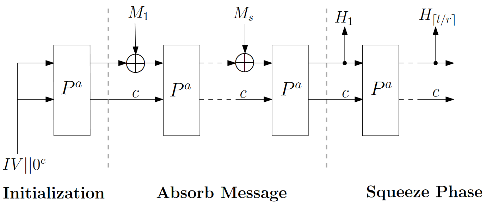
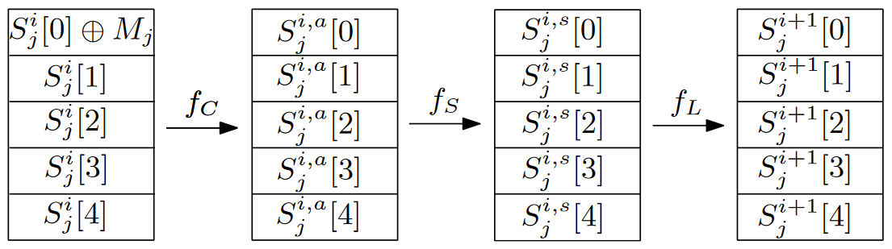
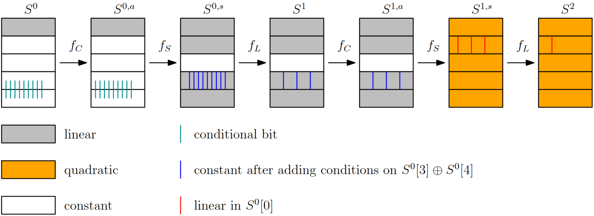
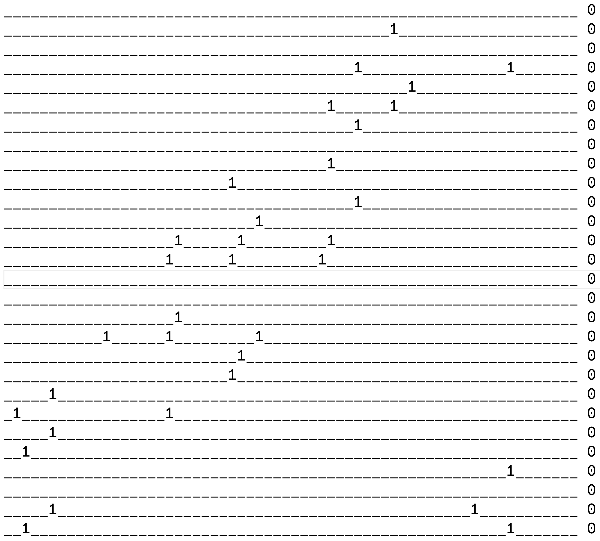
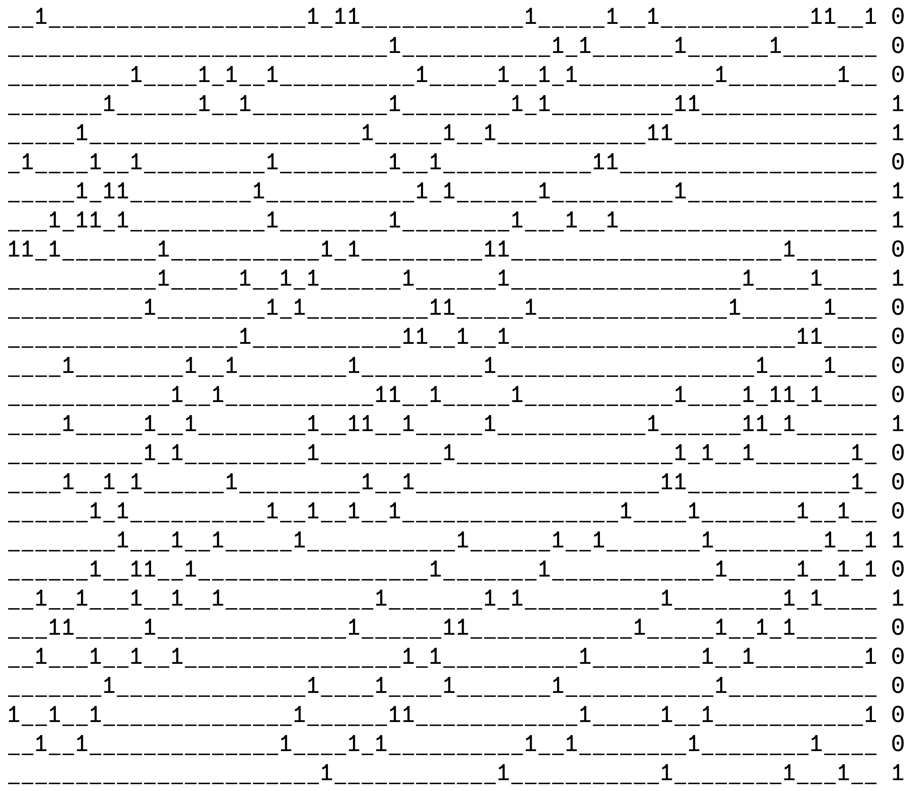

<!-- _class: cover_a -->
<!-- _paginate: "" -->
<!-- _footer: "" -->

# A Closer Look at the S-Box: Deeper Analysis of Round-Reduced ASCON-HASH

Xiaorui Yu, Fukang Liu, Gaoli Wang, Siwei Sun, Willi Meier
SAC(CCF-C) 2023

## 研究问题及研究意义

研究问题：缩减轮数ASCON-HASH的碰撞攻击

研究意义：NIST宣布ASCON系列算法进行轻量级密码学标准化。

## 问题背景

---

---

$f_C: X2 \leftarrow X2 \oplus c_i$

|  $i$  | 0    |  1   |  2   |  3   |  4   |  5   |  6   |  7   |  8   |  9   |  10  |  11  |
| :---: | ---- | :--: | :--: | :--: | :--: | :--: | :--: | :--: | :--: | :--: | :--: | :--: |
| $c_i$ | `f0` | `e1` | `d2` | `c3` | `b4` | `a5` | `96` | `87` | `78` | `69` | `5a` | `4b` |

$f_S:
\begin{cases}
y_0 = x_4x_1\oplus x_3\oplus x_2x_1\oplus x_2\oplus x_1x_0\oplus x_1\oplus x_0 \\
y_1 = x_4\oplus x_3x_2\oplus x_3x_1\oplus x_3\oplus x_2x_1\oplus x_2\oplus x_1\oplus x_0 \\
y_2 = x_4x_3\oplus x_4\oplus x_2\oplus x_1\oplus 1 \\
y_3 = x_4x_0\oplus x_4\oplus x_3x_0\oplus x_3\oplus x_2\oplus x_1\oplus x_0 \\
y_4 = x_4x_1\oplus x_4\oplus x_3\oplus x_1x_0\oplus x_1
\end{cases}$

$f_L:
\begin{cases}
X_0 \leftarrow X_0 \oplus (X_0 \ggg 19) \oplus (X_0 \ggg 28) \\
X_1 \leftarrow X_1 \oplus (X_1 \ggg 61) \oplus (X_1 \ggg 39) \\
X_2 \leftarrow X_2 \oplus (X_2 \ggg 1) \oplus (X_2 \ggg 6) \\
X_3 \leftarrow X_3 \oplus (X_3 \ggg 10) \oplus (X_3 \ggg 17) \\
X_4 \leftarrow X_4 \oplus (X_4 \ggg 7) \oplus (X_4 \ggg 41)
\end{cases}$

## 攻击框架

寻找两组消息：$(M_1,M_2,M_3)$和$(M_1,M_2,M_3')$使得2轮ASCON-HASH后状态差分为`*||0||0||0||0`

差分路径：

| $\Delta S^0(2^{-54})$                                        | $\Delta S^1(2^{-102})$                                       | $\Delta S^2$                                                 |
| :----------------------------------------------------------- | :----------------------------------------------------------- | :----------------------------------------------------------- |
| `0x0xbb450325d90b1581` `0x0` `0x0` `0x0` `0x0` | `0x2201080000011080` `0x2adf0c201225338a` `0x0` `0x0000000100408000` `0x2adf0c211265b38a` | `0xbaf571d85e1153d7` `0x0` `0x0` `0x0` `0x0` |

- 阶段1：枚举$(M_1,M_2)$，满足54个比特条件
- 阶段2：枚举$(M_3)$，满足102个比特条件，则$M_3'=M_3\oplus \Delta S^0[0]$

## 差分路径条件

第1轮54个条件：27*2

27个位置`0xbb450325d90b1581`：

- $S_{2}^{0}[1] = \Delta y_0 \oplus 1$

- $S_{2}^{0}[3] \oplus S_{2}^{0}[4] = \Delta y_3 \oplus 1$

---

第2轮102个条件：7\*3+3\*3+18\*4

- 7个位置`0x2201080000011080`：$S_{2}^{1,a}[0] \oplus S_{2}^{1,a}[4]=0$，$S_{2}^{1,a}[1]=1$，$S_{2}^{1,a}[3]=0$；

- 3个位置`0x0000000100408000`：$S_{2}^{1,a}[3] \oplus S_{2}^{1,a}[4]=0$，$S_{2}^{1,a}[1]=0$，**$S_{2}^{1,a}[2]=0$**；

- 18个位置`0x08de04201224230a`：$S_{2}^{1,a}[1] \oplus S_{2}^{1,a}[4]=0$，$S_{2}^{1,a}[0]=0$，**$S_{2}^{1,a}[2]=0$**，$S_{2}^{1,a}[3]=0$；

由于：$y_2 = x_4x_3\oplus x_4\oplus x_2\oplus x_1\oplus 1$ 与 $x_0$无关，将21个条件（二次）提前到第一轮

剩余：81个条件64个变量$S_{2}^{0}[0]$的线性方程组

## 优化消息2的搜索

从27个$S_{2}^{0}[1] = \Delta y_0 \oplus 1$出发：

---

由于第1轮的状态是线性（常量），将目标表示为第1轮的状态：

$$
\begin{align}
& S_{2}^{0}[1][i] = S_{1}^{2}[1][i] \\
=& S_{1}^{1,s}[1][i]\oplus S_{1}^{1,s}[1][i+61]\oplus S_{1}^{1,s}[1][i+39] \\
=& S_{1}^{1}[1][i] S_{1}^{1}[3][i] \oplus S_{1}^{1}[1][i+61] S_{1}^{1}[3][i+61] \oplus S_{1}^{1}[1][i+39] S_{1}^{1}[3][i+39] \\
\oplus& L_{i}(S_{1}^{1}[0],...,S_{1}^{1}[4])
\end{align}
$$

两种方法线性化：

- 直接猜测$S_{1}^{1}[3][i]$，多一个线性方程

- $y_3 = (x_4\oplus x_3 \oplus 1)x_0 \oplus (x_4\oplus x_3\oplus x_2\oplus x_1)$，转化为$S_{1}^{0}[1]$的约束，通过遍历消息1满足。

## 混合两种线性化方法

- 遍历$M_1$，满足31个位置`0x9b26c19264c9b66d`上$S_{1}^{0}[4]\oplus S_{1}^{0}[3] = 1$，对应24个$S_{1}^{1}[3][i]$，进入下一步

- 猜测28个剩余的$S_{1}^{1}[3][i]$，产生28个线性约束

  - 结合线性化后27个线性约束，得到55个约束64个变量的线性方程组，约化产生9个自由变量

  - 使用剩下的27个约束9个变量构建二次方程组

  - 求解后得到$M_2$，计算到第三轮初始，满足21个二次约束，进行下一步

- 建立81个条件64个变量的线性方程组，判断$M_3$是否存在

## 第二轮方程（左：猜测28个变量，右：线性化后的27个方程）

<!-- _class: cols-2 -->

## 复杂度的计算

$$
\begin{align}
&2^{28}\times 2^{31}+2^{28}\times 2^{28}\times (55^{2}\times 64+(27^2\times 45+2^{3}\times 12^{2}\times 6))\times 2^{-11} + 2^{17}\times (81^{2}\times 64) \times 2^{-11} = 2^{62.9}  \\

&2^{28}\times 2^{31}+2^{28}\times 2^{28}\times (2^{17.6}+2^{15.3})\times 2^{-11} + 2^{17}\times (81^{2}\times 64) \times 2^{-11} \approx 2^{62.6}
\end{align}
$$

- $2^{28}\times 2^{31}$：$2^{54+102-128}=2^{28}$个符合31比特条件的$M_1$

- $2^{28}\times 2^{28}\times (55^{2}\times 64+(27^2\times 45+2^{3}\times 12^{2}\times 6))\times 2^{-11}$：对$2^{28}$个符合31比特条件的$M_1$，猜测28比特

  - 得到55约束64变量的线性方程组，剩余64-55=9个自由变量

  - 得到27约束9变量的二次方程组，即27约束$\frac{9\times(9+1)}{2}=45$变量的线性方程组

  - 使用6个变量的$\frac{6\times(6-1)}{2}=15$个二次项进行消元，只要猜测9-6=3个变量，就可以得到27-15=12约束6变量的线性方程组

- $2^{17}\times (81^{2}\times 64) \times 2^{-11}$：进行$2^{81-64}=2^{17}$次81约束64变量的线性方程组求解，$2^{-11}$转换单位（2轮Ascon-Hash）

## 改进攻击

在生成$M_1$时添加两个约束，分别在第17比特与第20比特上$S_{1}^{0}[4]\oplus S_{1}^{0}[3] = 1$：

- 使得$S_{1}^{1}[3][0]$和$S_{1}^{1}[3][3]$与$S_{1}^{0}[0]$(自变量)无关

- 得到53约束64变量的线性方程组，剩余64-53=11个自由变量

- 得到27约束11变量的二次方程组，即27约束$\frac{11\times(11+1)}{2}=66$变量的线性方程组

- 使用6个变量的$\frac{6\times(6-1)}{2}=15$个二次项进行消元，只要猜测11-6=5个变量，就可以得到27-15=12约束6变量的线性方程组

前：$2^{28}\times 2^{31}+2^{28}\times 2^{28}\times (55^{2}\times 64+(27^2\times 45+2^{3}\times 12^{2}\times 6))\times 2^{-11} + 2^{17}\times (81^{2}\times 64) \times 2^{-11} = 2^{62.93}$

后：$2^{28}\times 2^{33}+2^{28}\times 2^{26}\times (53^{2}\times 64+(27^2\times 66+2^{5}\times 12^{2}\times 6))\times 2^{-11} + 2^{17}\times (81^{2}\times 64) \times 2^{-11} = 2^{61.98}$

## 核心想法

- 使用线性比特条件，进行高斯消元判断条件的满足性，取代枚举后判断

- 重新调整比特条件，尽可能减少直接猜测比特。

<!-- 作者将阶段2的102个比特条件中的21个转移到阶段1，使得阶段2需要进行的次数减少，并且使用猜测比特的方式尽量增加线性比特条件，同时推断出更多的比特，从而降低阶段1的时间复杂度。 -->

## 论文贡献

- 降低了2轮ASCON-HASH的碰撞攻击的时间复杂度

## 个人评价

- 尽可能多的利用线性条件和高斯消元替代直接猜测变量。

改进意见：

- 可以用空间换时间，具有实际攻击的可能性

## 总结

ASCON是NIST在2023年选为轻量级密码标准的加密算法系列。对ASCON-HASH进行分析有助于了解该密码方案在实际中的安全性，同时对其他海绵结构的密码方案分析具有借鉴意义。在本论文中，作者对现有的2轮ASCON-HASH碰撞算法进行改进。通过分析S盒的特点，提取中足够多的线性特征，尽可能使用高斯消元代替原先方案中的枚举，实现算法的时间复杂度优化。我认为现有的算法使用预处理与查找表的方法可以在实现中进一步降低时间复杂度，具有实际攻击的可能性。（193）
