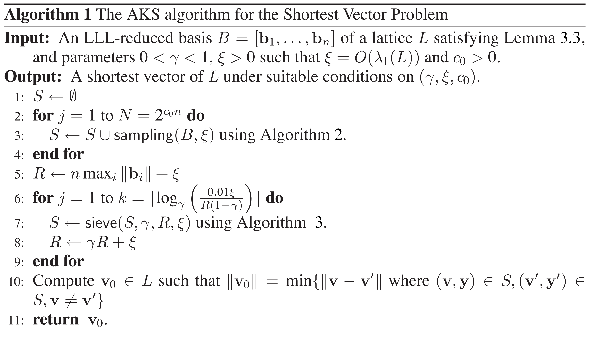
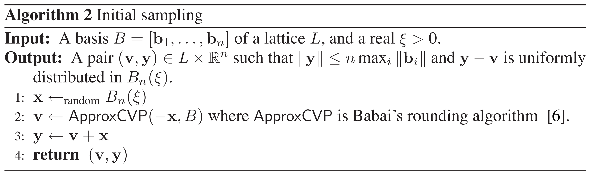
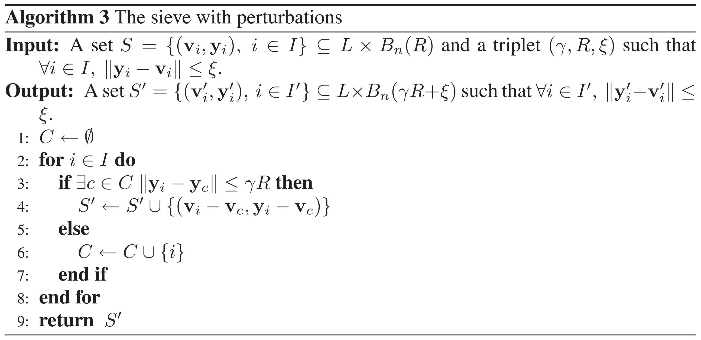
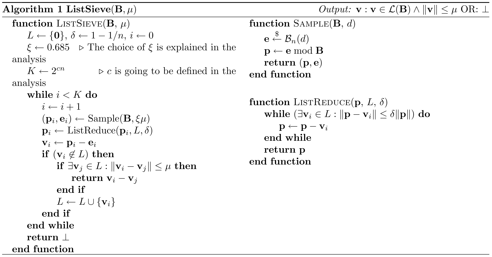
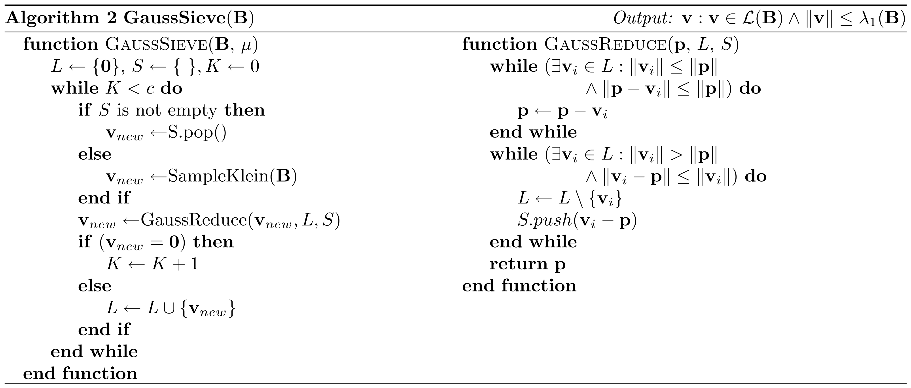

<!-- _class: cover_a -->
<!-- _paginate: "" -->
<!-- _footer: "" -->

# Faster exponential time algorithms for the shortest vector problem

Daniele Micciancio, Panagiotis Voulgaris
SODA(CCF-A) 2010

## 背景介绍

|     算法     |    类型     |          时间          |     空间     |
| :----------: | :---------: | :--------------------: | :----------: |
| Fincke-Pohst | Enumeration |      $2^{O(n^2)}$      |              |
|    Kannan    | Enumeration |   $2^{O(n\log{n})}$    |              |
|    AKS/NV    |   2-Sieve   |       $2^{5.9n}$       | $2^{2.95n}$  |
|   **List**   |   2-Sieve   |      $2^{3.199n}$      | $2^{1.325n}$ |
|  **Gauss**   |   2-Sieve   | $2^{0.52n}$(practical) | $2^{0.208n}$ |

## AKS/NV筛

---

## List筛

- AKS/NV筛缺陷：没有处理碰撞
- List筛：从空列表开始增加点，进行碰撞检查

## Gauss筛

- List筛缺陷：不删除向量，列表中会有长向量
- Gauss筛：会更新、删除长向量

## 实验结果

<!-- _class: cols-2 -->

<!-- 从图中可以看出，高斯筛的空间利用效率较高，而且在运行时间的表现也优于当时最优的筛法。 -->

## 论文贡献

- 理论：将球体堆积理论与筛法性能相结合

- 算法：改进了AKS筛，提出了ListSieve及其变体GaussSieve

<!-- 该论文的贡献主要体现在理论与算法两个方面。在理论方面，之前的工作中隐含了球面堆积理论，本文将该理论和算法进行了深度结合。在算法方面，本文改进了筛选的策略，主要想法是提早舍弃可能会产生碰撞的向量。 -->

## 个人评价

- 理论与实践都值得学习
- 根据筛选条件得到的短向量集合，整体质量较高（平均长度较短）

改进思路：

- 在投影格上得到的短向量集合使用枚举的方式进行提升

<!-- 高斯筛的结果保证每个向量之间的夹角大于60度，且相互约简无法得到更短的向量，整体的质量较高。从理论分析中可以得出，使用筛法进行SVP的求解时，求解维度与空间大小息息相关，在有限空间的情况下进一步求解更高维度的SVP，可能需要使用枚举方法。 -->

## 总结

格中最短向量问题（SVP）是格密码学中的核心难题。格密码中许多底层问题（NTRU，SIS，LWE）的密码学分析都可以归结为格中最短向量问题。SVP求解算法分为两类：枚举与筛选。筛选算法对大规模的向量集合进行内部组合，逐步降低向量集合的整体长度。AKS/NV筛在筛选之前就确定了向量集合的大小，对于筛选产生的重复向量无能为力。作者认为先前筛法效率较低的原因为：大量重复向量导致算法的空间和时间效率降低。于是作者先提出列表筛，从空列表开始添加经过筛选的质量较高的向量；再提出高斯筛，针对列表筛中存在的长向量进行更新。在理论层面，作者使用球体堆积理论通过SVP规模确定算法空间大小。我认为该论文在理论与实践层面都有价值，能够得到高质量的短向量集合，后续如果需要在空间受限的情况下进一步改进，可能需要与枚举算法结合。（319）
