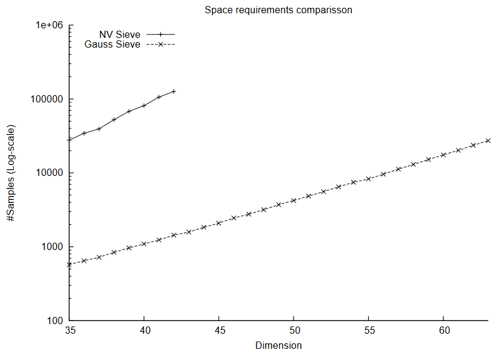
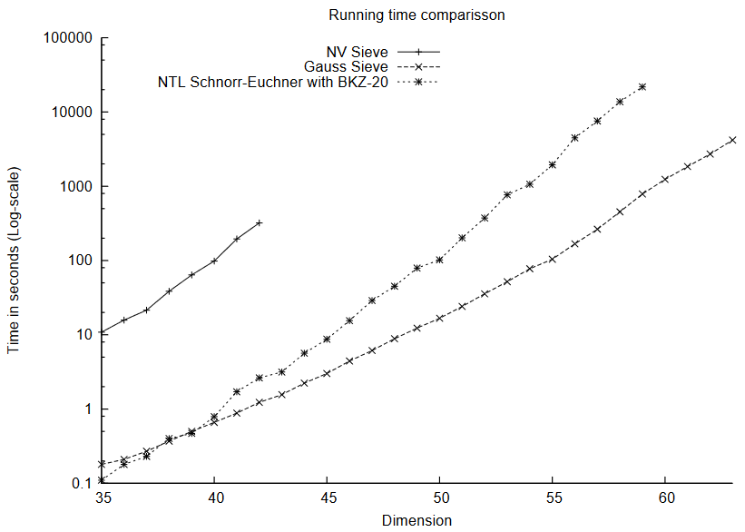

<!-- _class: cover_a-->
<!-- _paginate: "" -->
<!-- _footer: "" -->

# Faster exponential time algorithms for the shortest vector problem

Daniele Micciancio, Panagiotis Voulgaris
SODA(CCF-A) 2010

## 研究问题及研究意义

研究问题：使用筛法求解格中最短向量问题（SVP）

研究意义：格中最短向量问题是格密码学中的核心难题，许多底层问题（NTRU，SIS，LWE）的密码学分析都可以归结为该问题。

## AKS/NV筛

- 预处理过程中完成所有点的采样（使用小扰动降低碰撞的可能性）

- 重复执行筛法，逐渐缩短向量长度

<!-- AKS三人提出了第一个筛法求解SVP的算法，但在参数选择、复杂度分析等方面不是很完善。NV在后续研究中确定了合适的参数，并给出单指数复杂度的SVP求解算法。 -->

## 核心想法

- AKS/NV筛缺陷：在多轮后可能会产生大量的碰撞

- ListSieve：从空列表开始增加点，尽早检查碰撞产生的可能性
  - 使用高维球覆盖点数量分析算法的空间复杂度

- GaussSieve：在ListSieve的基础上加入更新，删除点

<!-- 列表筛可以看成是动态版本的AKS/NV筛，不是在初始化阶段进行采样，而是在执行筛法的过程中采样并增加点。由于在新增点时会判断与现有点之间的距离（角度），可以用球覆盖的原理进行分析。由于列表筛是不删除点的，同样会导致空间和时间的浪费，改进列表的维护策略得到更优的高斯筛。 -->

## 实验结果

<!-- _class: cols-2 -->

<!-- 从图中可以看出，高斯筛的空间利用效率较高，而且在运行时间的表现也优于当时最优的筛法。 -->

## 论文贡献

- 理论：将球体堆积理论与筛法性能相结合

- 算法：改进了AKS筛，提出了ListSieve及其变体GaussSieve

<!-- 该论文的贡献主要体现在理论与算法两个方面。在理论方面，之前的工作中隐含了球面堆积理论，本文将该理论和算法进行了深度结合。在算法方面，本文改进了筛选的策略，主要想法是提早舍弃可能会产生碰撞的向量。 -->

## 个人评价

- 理论与实践都值得学习
- 根据筛选条件得到的短向量集合，整体质量较高（平均长度较短）

改进思路：

- 在投影格上得到的短向量集合使用枚举的方式进行提升

<!-- 高斯筛的结果保证每个向量之间的夹角大于60度，且相互约简无法得到更短的向量，整体的质量较高。从理论分析中可以得出，使用筛法进行SVP的求解时，求解维度与空间大小息息相关，在有限空间的情况下进一步求解更高维度的SVP，可能需要使用枚举方法。 -->

## 总结

格中最短向量问题（SVP）是格密码学中的核心难题。格密码中许多底层问题（NTRU，SIS，LWE）的密码学分析都可以归结为格中最短向量问题。SVP求解算法分为两类：枚举与筛选。筛选算法对大规模的向量集合进行内部组合，逐步降低向量集合的整体长度。AKS/NV筛在筛选之前就确定了向量集合的大小，对于筛选产生的重复向量无能为力。作者认为先前筛法效率较低的原因为：大量重复向量导致算法的空间和时间效率降低。于是作者先提出列表筛，从空列表开始添加经过筛选的质量较高的向量；再提出高斯筛，针对列表筛中存在的长向量进行更新。在理论层面，作者使用球体堆积理论通过SVP规模确定算法空间大小。我认为该论文在理论与实践层面都有价值，能够得到高质量的短向量集合，后续如果需要在空间受限的情况下进一步改进，可能需要与枚举算法结合。（319）
