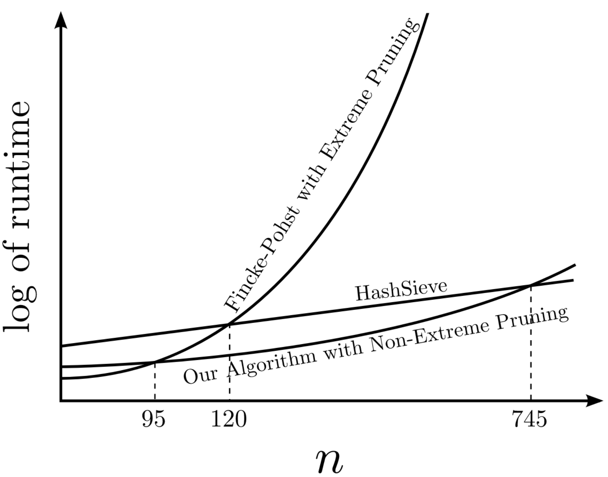

<!-- _class: cover_a -->
<!-- _paginate: "" -->
<!-- _footer: "" -->

# Fast Lattice Point Enumeration with Minimal Overhead

Daniele Micciancio, Michael Walter
SODA(CCF-A) 2015

## 研究问题及研究意义

研究问题：使用枚举方法求解格中最短向量问题（SVP）

研究意义：格中最短向量问题是格密码学中的核心难题，许多底层问题（NTRU，SIS，LWE）的密码学分析都可以归结为该问题。

## 研究现状（论文中）

- 枚举
  - 理论：Kannan提出时间复杂度为$2^{O(n\log n)}$的算法，但需要额外的预处理
  - 实际：时间复杂度为$2^{O(n^2)}$的算法

- 筛法：时间复杂度为$2^{O(n)}$，空间复杂度为$2^{O(n)}$

<!-- 枚举算法是在计算机领域中的一种常用算法，其特点为内存占用较小。在当时，枚举算法的理论最优算法为Kannan提出的，但由于需要耗时的预处理，在实际算法实现中往往采用传统的时间复杂度为2^O(n^2)的枚举算法；而筛法虽然存在时间复杂度较低的算法，但需要指数级别的空间。 -->

## 核心想法

- Kannan算法：先将格基预处理为准HKZ基（缺陷：速度慢），再进行枚举算法

- 预处理和枚举都是递归的过程
  - 删除单次递归中不必要的运算
  - **增加递归的步长**

<!-- Kannan算法的预处理算法需要递归（步长为1）执行LLL约化和HKZ约化共O(logn)次，这个预处理过错比后续的枚举过程更慢，所以想到的第一步是减少LLL约化和HKZ约化的运行次数，其次想到的是增加递归的步长，也就是每次投影k维而不是1维，我认为第二点是这篇论文的核心。 -->

## 实验结果

<!-- 从图中可以看出在格维数较高时，不带剪枝的本文算法优于现有的带剪枝枚举算法；而且在合理的格维数下全面优于筛法。 -->

## 论文贡献

- 提出并实现了预处理代价更小的，时间复杂度为$2^{O(n\log n)}$的新枚举算法

- 提出并实现了存在线性相关性的投影格上的枚举方法

- SVP求解速度优于现有的枚举算法

<!-- 根据作者在前面的想法，对Kannan算法进行了改进与实现。对于实现中遇到的可能存在线性相关投影格的情况，设计了新的不使用LLL算法的枚举方法，提升了效率。并且在没有进行额外剪枝的情况下，实际效率超过现有的枚举算法。 -->

## 个人评价

- 增加递归的步长，虽然在时间复杂度上没有区别，但在实际表现中有性能提升

- 重新思考SubSieve，在投影格上进行筛法并提升的核心想法其实是来源于枚举算法

改进思路：

- 与BKZ算法进行结合

- 剪枝

<!-- 本文与m4ri的改进思路有一些相似之处，增加步长虽然没有降低理论时间复杂度，但提升了实际运行效率。另一方面，对于在投影子格上进行的筛法，其想法来自于枚举算法，可以看作是筛法和枚举的结合。对于后续的改进，除了枚举算法一贯以来的剪枝优化以外，可以考虑使用BKZ算法。 -->

## 总结

格中最短向量问题（SVP）是格密码学中的核心难题。格密码中许多底层问题（NTRU，SIS，LWE）的密码学分析都可以归结为格中最短向量问题。SVP求解算法分为两类：枚举与筛选。枚举算法使用递归投影进行遍历；筛选算法对大规模的向量集合进行内部组合，逐步降低向量集合的整体长度。Kannan提出的理论枚举算法虽然具有较低的时间复杂度，但由于预处理过程过于耗时，没有被用于实际求解。作者对Kannan的算法进行了分析，采用了简化预处理过程，增加递归步长等多种方法，实现了时间复杂度较低且实际可行的枚举算法，表现优于现有的枚举算法和筛法。我认为论文中算法提升效率的核心是增加递归步长，虽然没有改进理论时间复杂度，但提升了实际求解效率，后续可以尝试使用BKZ算法以及剪枝进一步提升枚举算法的效率。（305）
