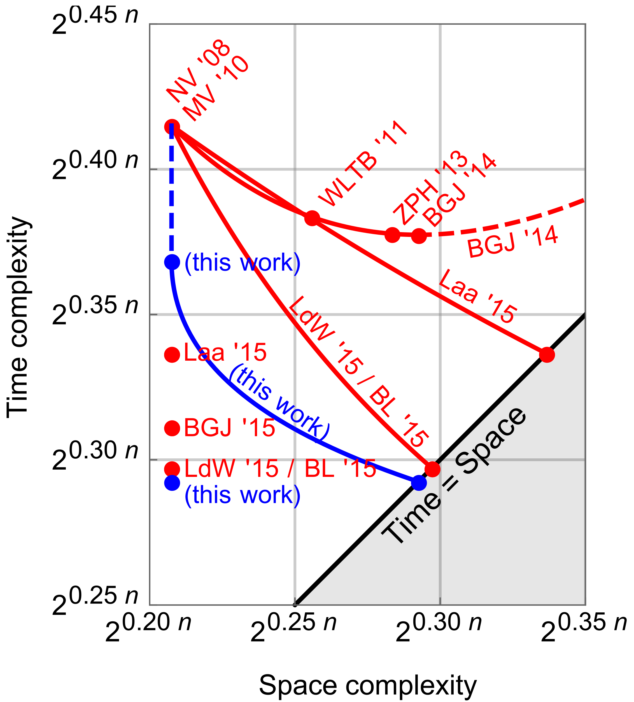

<!-- _class: cover_a -->
<!-- _paginate: "" -->
<!-- _footer: "" -->

# New Directions in Nearest Neighbor Searching with Applications to Lattice Sieving

Anja Becker, L&eacute;o Ducas, Nicolas Gama, Thijs Laarhoven

## 背景介绍

- 最近邻搜索(NNS)问题：给定N个n维向量集合，通过预处理，使得寻找某个向量在集合中的最近邻向量时间在$O(N^{\rho})(\rho<1)$

- 近似NNS：距离给定向量$\boldsymbol{v}$最近的向量距离$r_1$(角度$\theta_1$)，其余向量大于距离$r_2$(角度$\theta_2$)

- 高维球面：$\mathcal{S}^{n-1}:=\{\boldsymbol{x}\in \mathbb{R}^n, ||\boldsymbol{x}||=1\}$
- 高维圆锥：$\mathcal{H}_{\boldsymbol{v},\alpha}:=\{\boldsymbol{x}\in \mathbb{R}^n, \langle\boldsymbol{v},\boldsymbol{x}\rangle \ge \alpha\}$
- 高维球冠：$\mathcal{C}_{\boldsymbol{v},\alpha}:=\mathcal{S}^{n-1}\cap \mathcal{H}_{\boldsymbol{v},\alpha}$
  - 测度占比$\mathcal{C_n}(\alpha)=\frac{\mu(\mathcal{C}_{\boldsymbol{v},\alpha})}{\mu(\mathcal{S}^{n-1})}$
- 高维球面楔：$\mathcal{W}_{\boldsymbol{v},\alpha,\boldsymbol{w},\beta}:=\mathcal{S}^{n-1}\cap \mathcal{H}_{\boldsymbol{v},\alpha}\cap \mathcal{H}_{\boldsymbol{w},\beta}$
  - 测度占比$\mathcal{W_n}(\alpha,\beta,\theta)=\frac{\mu(\mathcal{W}_{\boldsymbol{v},\alpha,\boldsymbol{w},\beta})}{\mu(\mathcal{S}^{n-1})}$，其中$\langle\boldsymbol{v},\boldsymbol{w}\rangle=\theta$

## 局部敏感哈希(LSH)

- 局部敏感哈希(LSH)：hash函数族$\mathcal{H}$。
  - 其中的hash函数满足：相近的向量大概率hash值相同

- 预处理：取t组k个hash函数$h_{i,j}\in \mathcal{H}$，对每个向量$\boldsymbol{w}$计算t组$h_i(\boldsymbol{w})=(h_{i,1}(\boldsymbol{w}),\cdots,h_{i,k}(\boldsymbol{w}))$，生成t个hash table

- 查找：对于向量$\boldsymbol{v}$，将$h_i(\boldsymbol{v})$在hash table中对应的所有$\boldsymbol{w}$纳入$\boldsymbol{v}$的近邻向量候选

- 定义hash函数的碰撞概率：
  $$
  p(\theta):=\mathop{\text{Pr}}\limits_{h \sim \mathcal{H}}[h(\boldsymbol{v})=h(\boldsymbol{w})|\boldsymbol{v},\boldsymbol{w}\in \mathcal{S}^{n-1},\langle \boldsymbol{v},\boldsymbol{w} \rangle = \cos \theta]
  $$

---

- 若向量角度大于$\theta_2$，希望hash值相等的概率低：调整k

  $$
  \begin{align*}

  P_2 &=\text{Pr}[h_i(\boldsymbol{v})=h_i(\boldsymbol{w})|\boldsymbol{v},\boldsymbol{w}\in \mathcal{S}^{n-1},\langle \boldsymbol{v},\boldsymbol{w} \rangle \le \cos \theta_2] \\
  &=\prod\limits_{j=1}^{k} \text{Pr}[h_{i,j}(\boldsymbol{v})=h_{i,j}(\boldsymbol{w})|\boldsymbol{v},\boldsymbol{w}\in \mathcal{S}^{n-1},\langle \boldsymbol{v},\boldsymbol{w} \rangle \le \cos \theta_2] \le p(\theta_2)^k \le \frac{1}{N}

  \end{align*}
  $$

  - $k \ge \frac{\log N}{- \log p(\theta_2)}$

- 若向量角度小于$\theta_1$，希望至少要有一组相同的hash值：调整t

  $$
  P_1 =\text{Pr}[h_i(\boldsymbol{v})=h_i(\boldsymbol{w})|\boldsymbol{v},\boldsymbol{w}\in \mathcal{S}^{n-1},\langle \boldsymbol{v},\boldsymbol{w} \rangle \ge \cos \theta_1] \ge p(\theta_1)^k \ge N^{-\frac{\log p(\theta_1)}{\log p(\theta_2)}}
  $$

  - $t \cdot P_1 \ge 1$，即$t \ge \frac{1}{P_1} = N^{\frac{\log p(\theta_1)}{\log p(\theta_2)}}$

- 时间复杂度：计算$t \cdot k$次hash，$\widetilde{O}(N^{\frac{\log p(\theta_1)}{\log p(\theta_2)}})$

## 局部敏感过滤(LSF)

- 局部敏感过滤(LSF)：过滤函数族$\mathcal{F}$

- 预处理：取t组k个过滤函数$f_{i,j}\in \mathcal{F}$，对每个向量$\boldsymbol{w}$进行t次组合过滤$f_i(\boldsymbol{w})=(f_{i,1}(\boldsymbol{w}),\cdots,f_{i,k}(\boldsymbol{w}))$，生成t个过滤后的向量集合$(L_1,\cdots,L_t)$

- 查找：对于向量$\boldsymbol{v}$，将能通过的$f_i(\boldsymbol{v})$对应的过滤集合中对应的所有$\boldsymbol{w}$纳入$\boldsymbol{v}$的近邻向量候选

- 定义过滤函数的碰撞概率：
  $$
  p(\theta):=\mathop{\text{Pr}}\limits_{f \sim \mathcal{F}}[\boldsymbol{v},\boldsymbol{w}\in L_f|\boldsymbol{v},\boldsymbol{w}\in \mathcal{S}^{n-1},\langle \boldsymbol{v},\boldsymbol{w} \rangle = \cos \theta]
  $$
  - $p(0)$：随机向量通过过滤函数$f$的概率$\text{Pr}[\boldsymbol{v}\in L_f|\boldsymbol{v}\in \mathcal{S}^{n-1}]$
  - $t\cdot p(0)^k$：随机向量能通过组合过滤的数量

---

- 若角度大于$\theta_2$，希望最终被分在一个组中的概率低：调整k

  $$
  \begin{align*}

  P_2 &=\text{Pr}[\boldsymbol{w}\in L_i|\boldsymbol{v},\boldsymbol{w}\in \mathcal{S}^{n-1},\boldsymbol{v}\in L_i,\langle \boldsymbol{v},\boldsymbol{w} \rangle \le \cos \theta_2] \\
  &=\prod\limits_{j=1}^{k} \frac{\text{Pr}[\boldsymbol{v},\boldsymbol{w} \in L_{i,j}|\boldsymbol{v},\boldsymbol{w}\in \mathcal{S}^{n-1},\langle \boldsymbol{v},\boldsymbol{w} \rangle \le \cos \theta_2]}{\text{Pr}[\boldsymbol{v}\in L_{i,j}|\boldsymbol{v}\in \mathcal{S}^{n-1}]} \le \left(\frac{p(\theta_2)}{p(0)}\right)^k \le \frac{1}{N}

  \end{align*}
  $$

  - $k \ge \frac{\log N}{\log p(0) - \log p(\theta_2)}$

- 若角度小于$\theta_1$，希望最终被分在一个组中：调整t

  $$
  P_1 =\text{Pr}[\boldsymbol{w}\in L_i|\boldsymbol{v},\boldsymbol{w}\in \mathcal{S}^{n-1},\boldsymbol{v}\in L_i,\langle \boldsymbol{v},\boldsymbol{w} \rangle \ge \cos \theta_1] \ge \left(\frac{p(\theta_1)}{p(0)}\right)^k \ge N^{-\frac{\log p(0) - \log p(\theta_1)}{\log p(0) - \log p(\theta_2)}}
  $$

  - $t \cdot p(0)^k \cdot P_1 \ge 1$，即$t \ge \frac{1}{p(0)^k\cdot P_1} = N^{\frac{-\log p(\theta_1)}{\log p(0)-\log p(\theta_2)}}$

- 时间复杂度：计算$t \cdot p(0)^k$次过滤函数，$\widetilde{O}(N^{\frac{\log p(0)-\log p(\theta_1)}{\log p(0)-\log p(\theta_2)}})$

## LSH和LSF实例

- Spherical LSH：单个hash函数通过采样$U=2^{\Theta(\sqrt{n})}$个单位向量$\boldsymbol{s_1},\boldsymbol{s_2},\cdots,\boldsymbol{s_U}$，取$\alpha=n^{-\frac{1}{4}}$，构造
  $$
  \begin{align*}
  H_{\boldsymbol{s_i}}:&=\mathcal{C}_{\boldsymbol{v},\alpha}\backslash \bigcup\limits_{j=1}^{i-1} H_{s_j} &
  p(\theta)&=\text{exp}\left[-\frac{\sqrt{n}}{2}\tan^2\left(\frac{\theta}{2}\right)(1+o(1))\right] \\
  &&\rho &= \frac{\log p(\theta_1)}{\log p(\theta_2)}=\frac{\tan^2(\theta_1/2)}{\tan^2(\theta_2/2)}(1+o(1))
  \end{align*}
  $$
- Spherical LSF：单个过滤函数通过一个随机单位向量$\boldsymbol{s}$，和一个角度$\alpha$，构造
  $$
  \begin{align*}
  F_{\boldsymbol{s}}:&=\mathcal{C}_{\boldsymbol{v},\alpha} &
  p(\theta)&=\text{exp}\left[\frac{n}{2}\ln\left(1-\frac{2\alpha^2}{1+\cos \theta}\right)(1+o(1))\right] \\
  &&\rho &= \frac{\log(1-\alpha^2)-\log\left(1-\frac{2\alpha^2}{1+\cos \theta_1}\right)}{\log(1-\alpha^2)-\log\left(1-\frac{2\alpha^2}{1+\cos \theta_2}\right)}(1+o(1))
  \end{align*}
  $$

## $\alpha$的取值

$$

\rho \mathop{\sim}\limits^{\alpha = 0} \frac{\log p(\theta_1)}{\log p(\theta_2)}=\frac{\tan^2(\theta_1/2)}{\tan^2(\theta_2/2)}

$$

- 当$\alpha=0$时，从理论时间复杂度来看，Spherical LSF和Spherical LSH相同
  $$
  k = \frac{\log N}{\log p(0) - \log p(\theta_2)} \ge 1 \Rightarrow \alpha \le \alpha_0:=\sqrt{1+\frac{N^{2/n}(\cos\theta_2-1)}{2N^{2/n}-\cos\theta_2-1}}
  $$

- 为了使$\rho$小，$\alpha$尽可能大，当$k=1$时，$\alpha$取到最大值

## BDGL构造

随机乘积编码(Random product codes)：使用直积进行Filter的构造

$$
C=Q\cdot(C_1 \times C_2 \times \cdots \times C_m)
$$

- $Q$代表$\mathbb{R}^n$上的均匀随机旋转，$n=m\cdot b$，$C_i\subset\sqrt{\frac{1}{m}}\mathcal{S}^{n-1}$，$C_i=\{\boldsymbol{c_{i,1}},\boldsymbol{c_{i,2},\cdots,\boldsymbol{c_{i,B}}}\}$
- 可以使用$B\cdot m$个长度为$b$的随机向量表示$M=B^m$个长度为$n$的随机向量
- 基于之前的分析：$B=t^{\frac{1}{m}}$

---

解码：对于一个向量$\boldsymbol{w}\in \mathcal{S}^{n-1}$，寻找所有$\boldsymbol{s}=(\boldsymbol{c_{1,j_1}}|\boldsymbol{c_{2,j_2}}|\cdots|\boldsymbol{c_{m,j_m}})$，满足$\langle \boldsymbol{w}, Q\boldsymbol{s} \rangle\ge \alpha$

算法：点乘可以简单的拆分

- 计算$\boldsymbol{v}= Q^{-1}\boldsymbol{w}$，并拆分$\boldsymbol{v}=(\boldsymbol{v_1}|\boldsymbol{v_2}|\cdots|\boldsymbol{v_m})$
- 对所有$\boldsymbol{v_i}$，计算$\langle\boldsymbol{v_i},\boldsymbol{c_{i,j}}\rangle$，并排序
- 深度有限搜索，通过改变阈值剪枝

一次查询时间复杂度：

$$
\mathcal{T}_{LD}(t,\alpha) = O(nB+mB\log B+mt\mathcal{C_n}(\alpha))
$$

## 应用到筛法中

- 目标：找到所有角度小于$\pi/3$的向量

- 询问$\alpha$：$\alpha$越大，查询代价越小
- 插入(预处理)$\beta$：$\beta$越大，需要构建更多的过滤器以保证查询成功率

- 期望过滤器数量：$t=1 / \mathcal{W_n}(\alpha,\beta,\pi/3)$
- 询问期望能通过过滤器的数量：$t\mathcal{C_n}(\alpha)$
- 每个过滤器中的期望向量数量：$N\mathcal{C_n}(\beta)$

---

<!-- _class: cols-2-64 -->

查询时间复杂度：$\mathcal{T}_1 = N \cdot \frac{\mathcal{C}_n(\alpha)\cdot(1+N\cdot\mathcal{C_n}(\beta))}{\mathcal{W_n}(\alpha,\beta,\pi/3)}$

预处理时间复杂度：$\mathcal{T}_2 = \frac{N\cdot\mathcal{C}_n(\beta)}{\mathcal{W_n}(\alpha,\beta,\pi/3)}$

空间复杂度：$\mathcal{S} = N + \frac{N\cdot\mathcal{C}_n(\beta)}{\mathcal{W_n}(\alpha,\beta,\pi/3)}$

- $(\alpha,\beta)=(0.5,0.5)$：$\mathcal{T}=\mathcal{S}=2^{0.292n+o(1)}$

- $(\alpha,\beta)=(0.25,0.5)$：$\mathcal{T}=2^{0.368n+o(1)},\mathcal{S}=2^{0.208n+o(1)}$

左下角的点只能使用NV筛

